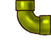
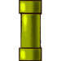

Cómo funciona: Videojuego Ayni
==============================

Este documento resume varios aspectos de diseño del videojuego
Ayni.

Puede leer este documento para conocer el desarrollo del juego
o como una guía inicial para modificar el código.

Sistema de Escenas
------------------

El bucle del juego se encuentra en el objeto ``World``, este objeto
encapsula a todo el juego y es el encargado de iniciar la biblioteca, el
modo de video y gestionar los eventos del usuario.

Al objeto ``World`` se le puede indicar una escena para que muestre, inicialmente
esta escena es ``Game``. Que pinta un fondo de pantalla junto con una red
de cañerías::

    w = world.World()
    w.change_scene(game.Game(w))
    w.loop()

A partir de la llamada a loop el programa queda en control del bucle del
juego que mantiene activa la escena hasta que desde algún punto se llame
a ``w.change_scene(...)`` con otra escena.

Cada escena tiene que heredar de ``Scene`` e implementar los métodos::

    * draw(screen)
    * update()
    * on_event()

Eventos
-------

El bucle principal propaga todos los eventos a las escenas, pero en caso de
llegar una petición para cerrar el juego la atiende antes de propagarla.

Para atender eventos desde las escenas se debe implementar el método
``on_event(self, event)``, por ejemplo::

    def on_event(self, event):
        if event.type == pygame.KEYDOWN:
            print "se ha pulsado la tecla:", event

Escena game
-----------

Game utiliza la tecnica de impresión dirty rectagles, por eso
al comenzar se llama a ``draw_background`` y posteriormente
solo se utilizan los grupos de sprites para imprimir.

Map, el escenario inicial
-------------------------

Todo el escenario está conformado por una grilla de celdas que tienen
el mismo tamaño.

Inicialmente esta grilla se almacena en el objeto ``Map``, que además
de pintar el escenario sobre la pantalla le informa a los personajes
del juego si pueden pisar o no sobre determinadas partes del escenario.

El objeto que va a generar el objeto ``Map`` es ``Game`` y es a su
vez el que lo comparte con los sprites del sistema.

Cada bloque de la pantalla tiene 75x75, y como la pantalla es
de 1280x720 pixeles, en total hay espacio para 17x9 bloques. Sobrando
5 y 45 pixeles de x e y respectivamente.

La matriz con los bloques que se deben imprimir se encuentra en la
clase ``Map`` (método _create_map).

``Map`` carga todo el escenario de un archivo llamado ``data/map/1.txt``.

Interacción con el Mouse
------------------------

El objeto que representa el mouse se llama ``MousePointer``, tanto
en el comportamiento como visualmente.

Este objeto se genera inicialmente dentro de ``Game``, aunque por ser
un sprite se podría adaptar para otras escenas.

Estados del mouse
_________________

El mouse utiliza estrategias como el objeto ``World`` y las escenas, donde
se define un objeto para cada estado y un método dentro de la clase ``MousePointer``
llamada ``change_state``.

El mouse solo va a interactuar con los objetos que tengan el atributo
``can_be_clicked`` en True.

Estos son los estados mas importantes:

    Normal
        El puntero del mouse se mueve por la escena buscando piezas para seleccionar.
    Dragging
        Se ha pulsado sobre una pieza y se comienza a deplazar.
    Drop
        Se ha soltado la pieza sobre un ``Placeholder``.
    PointAt
        Está por indicarle una coordenada a un trabajador.

El estado ``Normal`` es el permanece mas tiempo en ejecución, y éste utiliza
las siguientes imágenes para mostrar si el mouse puede iteractuar con un
objeto o si no...

Personaje
---------

El protagonista del juego se encuentra en el archivo ``Player.py``, e
internamente carga su propia grilla de gráficos de ``data/player/*.png``.

El objeto que crea al personaje es ``Map`` cuando encuentra
una ``x`` en el mapa del escenario.

Placeholder
-----------

Un ``Placeholder`` es una parte de la cañería sin completar, existe
en el juego como un bloque invisible donde el usuario puede colocar
cualquier parte de un tubería.

Estos objetos ``Placeholder`` se generan cuando el objeto ``Map`` recorre
todo el mapa dibujando bloques.

Pipe
----

El objeto representa una pieza de cañería que se puede arrastrar con el
mouse para colocar sobre un ``Placeholder``.

.. image:: ../data/front_pipes/2.png
.. image:: ../data/front_pipes/3.png

Animaciones
___________

Para realizar animaciones se utilizan conjuntamente las clases ``Animation`` y
``Sheet``, ambas del módulo ``animation``.

Desde la clase ``Player`` se cargan todas las animaciones en un diccionario que
luego se puede utilizar llamando a los métodos ``set_animation`` y ``update`` (que
hace avanzar la animación continuamente).

Para revisar
------------

Mensajes de los personajes
--------------------------

Para que los personajes puedan hablar hay un objeto que administra
todos los cuadros de mensajes llamado ``Messages``.

Cada objeto que conozca a ``Messages`` puede solicitarle que emita
un mensaje.

Cuando ``Messages`` tiene que crear un mensaje construye un objeto
``Balloon`` que se muestra en pantalla unos segundos.

El propio objeto ``Balloon`` se encarga de eliminarse de la pantalla.

    *Decoración del objeto Balloon:*

    .. image:: balloon.png

Protagonista
------------

El trabajador está implementado en el objeto ``Player``, y cada una
de las acciones que realiza se representa en un objeto diferente llamado
estado que hereda de ``State``.

Las animaciones son generalemente iniciadas por los estados, pero están
implementadas en el propio protagonista, ver los métodos ``set_animation``
en la clase ``Player``.

Estados
_______

Esta es una lista de los estados que actualmente se utilizan, y cada uno
de estos herada de ``State``.

Stand
    El personaje está en reposo. Si hacen click pasa a ``Wait``.
Wait
    Espera a que le digan que hacer. Sale de este estado cuando se hace click sobre la pantalla.
Walk
    Camina hacia el punto indicado, cuando llega pasa a ``Stand``.
Refuse
    Se niega a realizar algo, por ejemplo cuando le piden que salte de una plataforma.

Plataformas
-----------

El trabajador tiene una referencia al objeto ``Map`` para consultarle
si puede pisar o no en determinada parte del escenario.

El método de ``Map`` que indica si se puede pisar es ``can_stand_here``
y retorna ``True`` si se le pide una coordenada de pantalla donde 
el bloque que se ha dibujado es 2 u 8:

.. image:: data/2.png

.. image:: data/8.png
